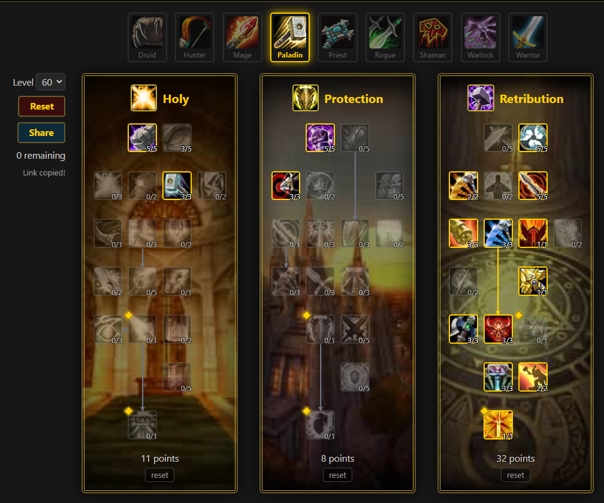
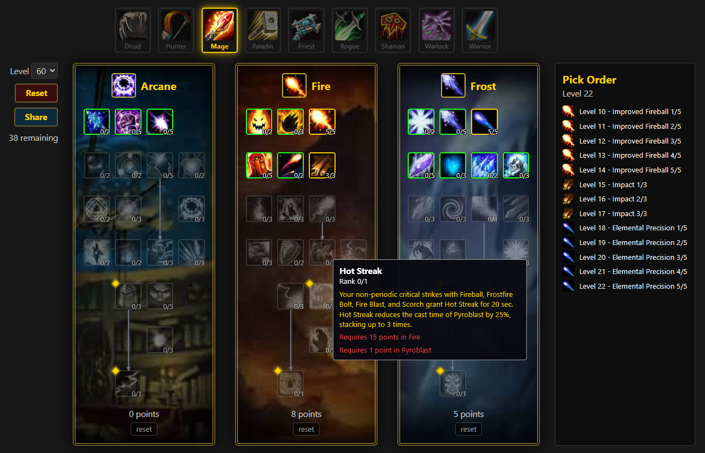

# WoW Forever Tools — Talent Calculator

Talent calculator for **WoW Forever** (Classic, level 60 / 51 talent points).
Plan, preview and share builds for all **9 classes**, each with its 3 classic
7×4 talent trees, WoW-style artwork, icons and tooltips.

Open `/{class}` in the browser — e.g. `/paladin`, `/warrior`, `/druid`,
`/hunter`, `/mage`, `/priest`, `/rogue`, `/shaman`, `/warlock` — and start
clicking talents.

## Screenshots


*The 3 trees sharing the 51-point pool, with per-tree counters.*


*Verbatim rank tooltip with Next Rank + the pick-order list (Level 10, 11, …).*

## What it does

- **Interactive trees** (`resources/js/calculator.js`): 3 side-by-side 7×4
  grids sharing one 51-point pool, with per-tree counters and a remaining-points
  counter. Left-click adds a point, right-click removes one.
- **Classic rules enforced in JS + re-validated on the server**:
  per-talent cap, 51-point pool, row gate (`(R-1)*5` points in rows above),
  prerequisites must be maxed (e.g. Illumination ← Reverence).
- **WoW-style presentation**: official Blizzard tree artwork as background,
  bronze/gold frames, spec icons, talent icons from `wow.zamimg.com`,
  tooltip with verbatim rank text + `Next Rank` while skilling.
- **Pick-order panel**: one line per spent point in learn order
  (`Level 10 - Divine Strength 1/5`, …). Header shows the character level
  (9 + spent points; 51 pts = 60). Removing a point drops that talent's most
  recent pick, so the list is always a valid sequence.
- **Level selector (10–60)**: caps the pool to `level - 9` points to plan
  leveling builds. Lowering the level trims picks from the end; reset restores 60.
- **Shareable builds**: `Share` packs the pick order into the page URL
  (`/{class}?b={code}[&level=N]`, ~22 chars for 19 picks) as base64url 6-bit
  talent indices — no storage, identical builds share identical links. Opening
  the link replays the picks through the same rules, so tampering stays legal.
- **Class bar**: all 9 Forever classes across the top; seeded classes link to
  their page (current one glows gold), the rest show as coming soon.
- **JSON API** for every class (see Routes below).

## Routes

| Method | Path | What |
|---|---|---|
| `GET` | `/{class}` | Calculator page (`App\Http\Controllers\ClassController@show`), 404 when the slug is not seeded |
| `GET` | `/api/classes/{slug}` | Class + ordered trees + talents by row/col, incl. `background`/`spec_icon`/`ranks`/`skill` (`Api\WowClassController`) |

## Tech stack

Laravel 13 · PHP 8.3 · SQLite (local) · Vite + Tailwind CSS 4 · vanilla JS
(no SPA framework). Tests: PHPUnit (`tests/Feature/MageDataIntegrityTest.php`).

## Quickstart

```sh
composer install
cp .env.example .env   # or use composer setup below
php artisan key:generate
php artisan migrate --force
php artisan db:seed --class="Database\Seeders\ForeverClassSeeder" --force
npm install
npm run build          # or npm run dev for Vite HMR
php artisan test
```

Shortcut (install + migrate + build):

```sh
composer setup
```

Then visit `http://localhost:8000/paladin` (serve with `php artisan serve`
or `composer dev`).

## Data pipeline

No hand-written talent data per class. The flow is manifest-driven:

1. `php artisan forever:import {class}` (`App\Console\Commands\ImportForeverClass`)
   downloads the wowtbc.gg `page-data.json` for the class, writes
   `database/data/{class}_{tree}.json` with verbatim `ranks[]` + `skill` blocks,
   resolves icons against Wowhead Forever data, probes artwork backgrounds and
   merges `database/data/classes.json` (spec icons are filled by hand after a
   zamimg 200-check).
2. `Database\Seeders\ForeverClassSeeder` loads everything from
   `database/data/classes.json` (scoped slugs, 2 passes for prerequisites).
3. `GET /api/classes/{slug}` serves the DB content; `calculator.js` renders it
   generically (API URL from `#trees data-api`).

Key files:

| File | Role |
|---|---|
| `database/data/classes.json` | Class manifest: trees, data files, backgrounds, spec icons |
| `database/data/*_{tree}.json` | Source of truth per tree (row/col/slug/max_rank/requires_slug/status/description/ranks/skill/icon) |
| `database/seeders/ForeverClassSeeder.php` | Manifest-driven seeder for all classes |
| `resources/js/calculator.js` | Generic calculator (51-point pool, gates, tooltip, pick order, level cap, share) |
| `resources/views/calculator.blade.php` | Generic `/{class}` view: class bar + `#trees` slot + pick-order panel |
| `app/Models/Build.php` + `Api\BuildController.php` | Shareable builds (6-char hash, server-side replay) |
| `docs/calculator.md` | Build notes: scraping source, rules, icon/presentation status |

## Attribution

Talent data (c) wowtbc.gg / Blizzard. Icons (c) Blizzard via
`wow.zamimg.com` (short names only, hotlinked with text fallback). Tree
artwork hotlinked for educational use. See `docs/calculator.md` for the full
scraping and verification notes.
